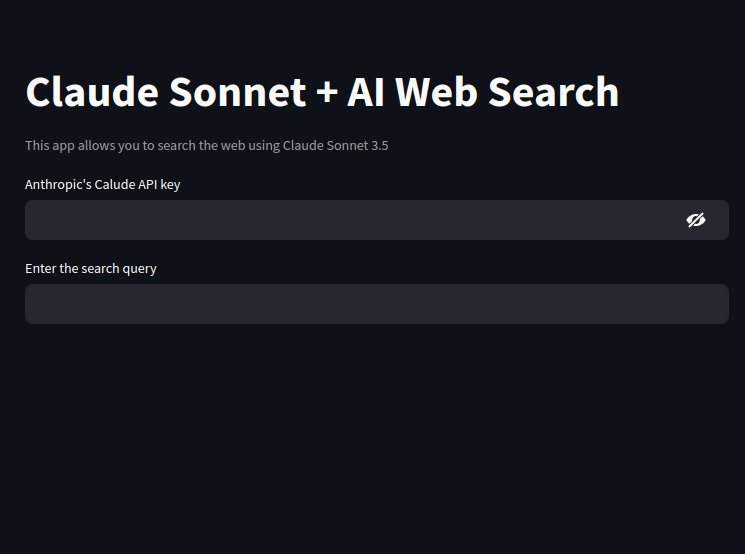

# A Simple We Search using Claude

Easily search the web using Claude and Streamlit. You will need the api key from Anthropic. Remember to sign up and get it.

### Getting Started
```sh
pip install -r requirements.txt
```
NB: It can also be pip3.

### Running using Streamlit

```sh
streamlit run app.py
```

